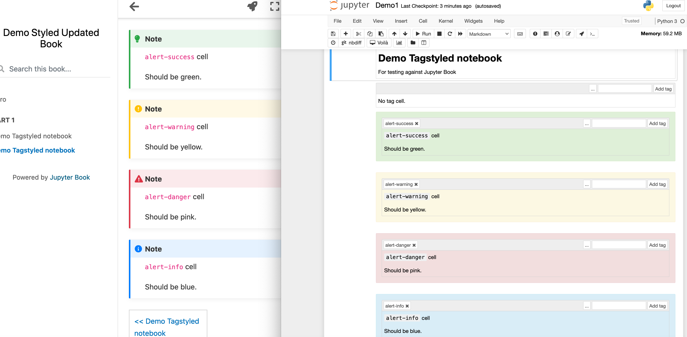

# ou-jupyter-book-tools
Tools for working with Jupyter Books

Simple tools to try to map OU tagged and styled notebooks onto sensible MyST / Jupyter Book styled features.

To run the demo:

- put your notebooks into `./content` directory;
- run the appropriate command(s) over them;
- build the book: `jupyter book build --path-output . content`
- view the book (in `./_build/html`).

## Tools

- `tags2myst tagstyler content` : wrap the content of [`nb_extension_tagstyler`](https://github.com/innovationOUtside/nb_extension_tagstyler) tagged cells (`alert-danger`, `alert-warning`, `alert-success`, `alert-info`) as a similarly colour themed admonition.

